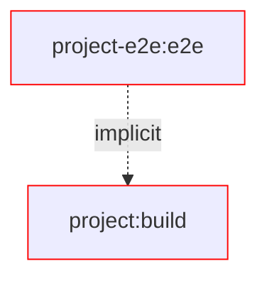
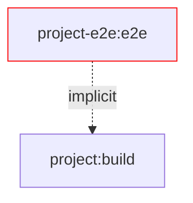
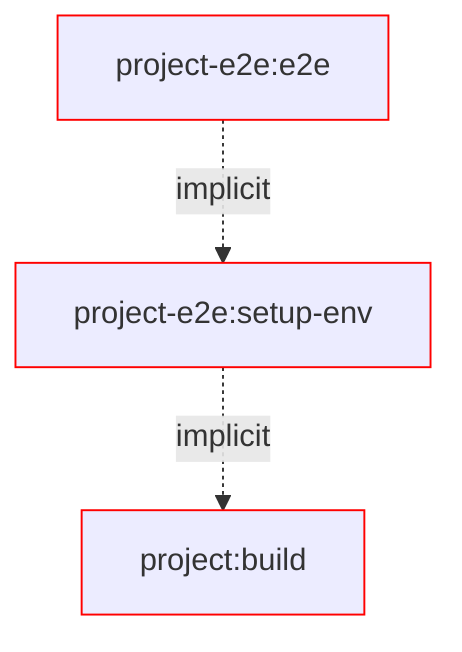
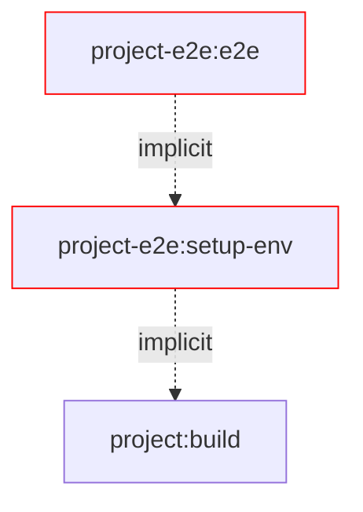
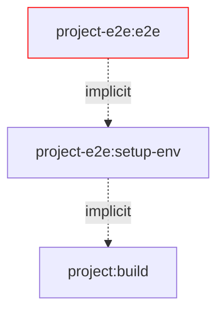

# NxVerdaccioE2eSetup

<a alt="Nx logo" href="https://nx.dev" target="_blank" rel="noreferrer"></a>

✨ **This workspace maintains enterprise grade E2E steup for vitest and verdaccio** ✨

This workspace maintains a scalable and maintainable E2E setup for Vite tests and Verdaccio.

## Getting started 

### Register Plugin

1. Configure the plugins in `nx.json`:

```json
{
  "plugins": [
    {
      "plugin": "@org/build.env",
      "options": {
        "environmentsDir": "tmp/environments"
      }
    }
  ]
}
```

### Configure the project you want to e2e test as published package

1. Add a `publishable` tag to the package under test

### Configure e2e project which tests the published package

1. Add the package under test as `implicitDependency` to your e2e project
2. Configure the `setup-env` target as dependent target by using `dependsOn` 

```jsonc
{
  // ...
  "e2e": {
    "dependsOn": [
      {
        "projects": "self",
        "target": "setup-env",
        "params": "forward"
      }
    ],
    // ...
  }
}
```

### Run e2e test

`nx run <e2e-project-name>:e2e`


## Debuggins e2e tests

Publishable project have a `publishable` tag.
Projects that need an environment have a `npm-env` tag.
Targets that need an environment set up before running depend on `{ "projects": "self", "target": "setup-env", "params": "forward"}`.

Production usage:

- `nx run cli-e2e:e2e` - setup environment and then run E2E tests for `cli-e2e`
  @TODO figure out why we can't set the environmentRoot in the target options in `project.json`
- `nx run cli-static-e2e:e2e --environmentRoot static-environments/user-lists` - setup NPM stuff in existing environment and then run E2E tests for `cli-static-e2e`

Debug full environment in 1 setup:

- `nx run cli-e2e:setup-env` - setup environment for `cli-e2e`
  - `nx run cli-e2e:setup-env --keepServerRunning` - keeps verdaccio running after setup
- `nx run cli-e2e:stop-verdaccio` - stops the verdaccio server for `cli-e2e`

Debug full environment in 2 steps:

- `nx run cli-e2e:bootstrap-env` - setup folders and starts verdaccio for `cli-e2e`
- `nx run cli-e2e:install-env` - bootstraps and installs all dependencies for `cli-e2e`
- `nx run cli-e2e:stop-verdaccio` - stops the verdaccio server for `cli-e2e`

Debug packages:

- `nx run cli-e2e:bootstrap-env` - setup folders and starts verdaccio for `cli-e2e`
- `nx run utils:npm-publish --environmentProject cli-e2e` - publishes `utils` and `models` to the verdaccio registry configured for `cli-e2e`
- `nx run utils:npm-install --environmentProject cli-e2e` - installs `utils` and `models` from the verdaccio registry configured for `cli-e2e`
- `nx run cli-e2e:stop-verdaccio` - stops the verdaccio server for `cli-e2e`
  

## Motivation

### Flaws in the current setup

One of the biggest flaws of e2e setups you find in the wild is one shared environment for all projects.

This leads to a lot of problems:

- flaky tests
- long setup times
- EXTREMELY hard to debug
- hard to maintain
- IMPOSSIBLE to scale

#### Changes files during e2e

The changed files during testing, interfere with configurations on your system.

```sh
User/
 └── <user-name>/
     ├── .npmrc # 🔓 added registry and token entry to OS user specific npm config
     └──Root/ # 👈 this is your CWD
        ├── node_modules/
        │   └── <org>
        │       └── <package-name>/... # 🔓 npm install installs into repository folder
        ├── dist/
        │   └── packages/
        │       └── <project-name>/...
        ├── tmp/
        │   └── local-registry/ # 😓 hard to debug a dynamic port
        │       ├── storage/...
        │       │   └── <org>
        │       │       └── <package-name>/... # nx nx-release-publish saves the package's tarball here
        │       └── <test-name>/...
        │                └── <test-case>/...
        ├── package-lock.json # 🔓 npm install/uninstall installs into workspace root
        └── package.json # 🔓 npm install/uninstall installs into workspace root
```

#### Task Performance

To elaborate on the performance issues, we show the different cases while writing tests.

##### Changes in source



##### Changes in the test environments


##### Changes in tests



### Solution

This workspace provides a scalable and maintainable E2E setup for Vite tests and Verdaccio.
It isolates all involved files into an isolated environment for each e2e project.

#### Changes files during e2e

The changed files during testing, are all in one isolated folder and don't interfere with your local setup.

```sh
Root/ # 👈 this is your CWD
├── dist/
│   └── packages/
│       └── <project-name>/...
└── tmp/
    └── e2e/
        └── <project-name>/ # e2e setup
            ├── storage/... # npm publish/unpublish
            ├── node_modules/
            │   └── <org>
            │       └── <package-name>/... # npm install/uninstall
            ├── __test__/...
            │   └── <file-name>/... # e2e beforeEach
            │        └── <it-block-setup>/...
            ├── .npmrc # local npm config configured for project specific verdaccio registry
            ├── package-lock.json # npm install/uninstall
            └── package.json # npm install/uninstall
```

#### Task Performance

To elaborate on the performance improvements, we show the different cases while writing tests.

##### Changes in source



##### Changes in the test environments



##### Changes in tests



## Connect with us!

- [Check out our services](https://push-based.io)
- [Follow us on Twitter](https://twitter.com/pushbased)
