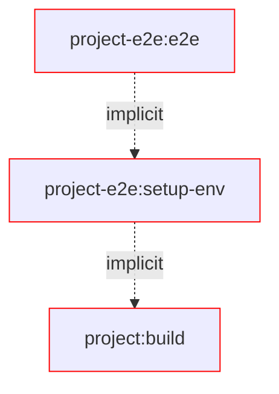
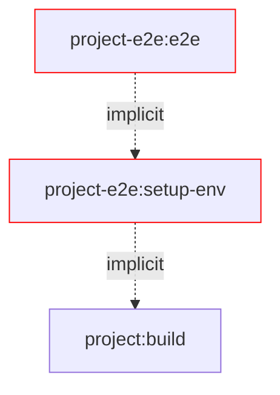
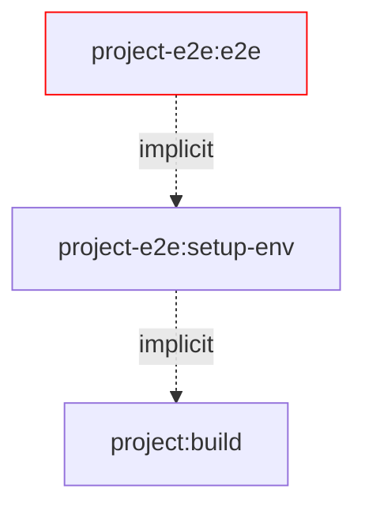
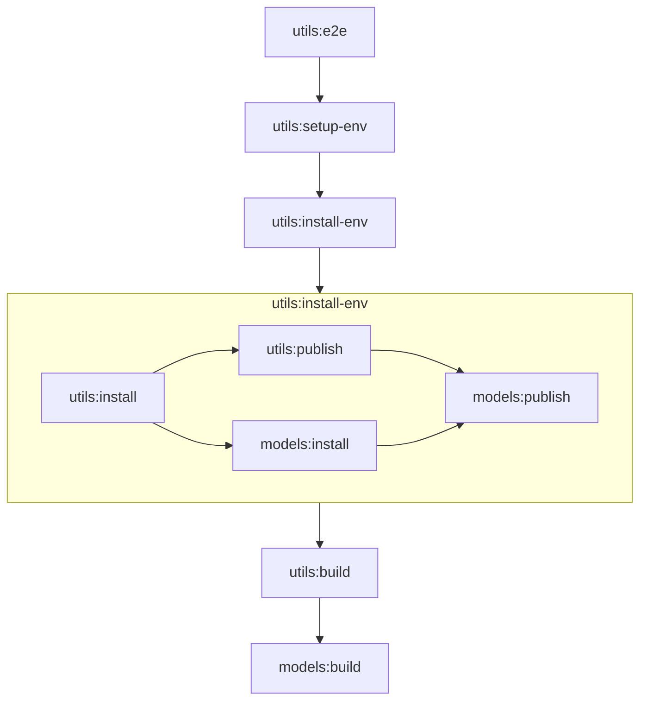

# Verdaccio Testing Environments Nx Plugin

### 🚀 Enterprise Grade Testing with Verdaccio and Nx ⚡

[](https://github.com/push-based/nx-verdaccio-env/releases/latest)
[](https://github.com/push-based/nx-verdaccio-env/releases)
[](https://opensource.org/licenses/MIT)
[](https://github.com/push-based/nx-verdaccio-env/actions/workflows/ci.yml?query=branch%3Amain)

Welcome to the **Verdaccio Testing Environments Nx Plugin** — your one-stop solution for running **blazingly fast**, **isolated**, and **scalable** end-to-end (e2e) tests with zero configuration. Yeah, you heard that right: **ZERO configuration**.

With this plugin, say goodbye to the old days of waiting around for your tests and hello to _next-level speed_. Plug it in, and you're good to go.

## Why You NEED This Plugin 🔥

**Key Features:**

- ⚙️ **ZERO Config** — You won’t need any global setup or teardown scripts.
- 🔥 **BRUTALLY FAST** — Up to **⚡110x faster⚡** than traditional setups. Yes, you read that right.
- 🛡️ **Isolated** — No more conflicts with local file systems. Everything’s clean.
- 🚀 **Scalable** — Run your tests in parallel, no matter how big your project.
- 🕒 **Optimized** — We cache everything we can, so your tests run faster over time.
- ⚡ **Developer Experience** — Streamlined and simplified. You focus on the code, we handle the setup.
- 🧪 **Easier Debugging** — Debugging e2e tests is now a piece of cake 🍰.

---

### 🏎️ **Speed Benchmarks** 🏎️

| Small Project (4 packages)    | Common Setup | Optimized Setup | [x] times faster | [%] percent faster |
| ----------------------------- | ------------ | --------------- | ---------------- | ------------------ |
| **Worst Case** Execution Time | 110 s        | 13 s            | 8.46x faster     | 746%               |
| **Best Case** Execution Time  | 110 s        | 1 s             | 110x faster      | 11000%             |

---

## Getting Started 🏁

### Step 1: Register and Configure in `nx.json`:

```jsonc
{
  "plugins": [
    {
      "plugin": "@push-based/build-env",
      "options": {
        "environments": {
          "environmentsDir": "tmp/environments", // Optional
          "targetNames": ["e2e"] // Optional
        }
      }
    }
  ]
}
```

> [!NOTE]
> Your configured targets now has a new dependency configured:
>
> ```jsonc
> {
>   "name": "utils-e2e",
>   "targets": {
>     "e2e": {
>       "dependsOn": [
>         // dynamically aded
>         { "target": "setup-env", "params": "forward" }
>       ]
>       // ...
>     }
>   }
>   // ...
> }
> ```

### Optional: Add the Package Under Test as implicitDependency (OPTIONAL)

Let the plugin detect your implicit dependencies:

```jsonc
// projects/utils-e2e/project.json
{
  "name": "utils-e2e",
  "implicitDependency": ["utils"]
}
```

### Step 3: Run the E2E Test

```bash
nx run utils-e2e:e2e
```

Tadaaaa! 🎉 You’re now testing at light speed!

## Configuration Options 🛠️

| Name                             | type                                    | description                                                    |
| -------------------------------- | --------------------------------------- | -------------------------------------------------------------- |
| **environments.environmentsDir** | `string` (DEFAULT `'tmp/environments'`) | Directory for environment storage.                             |
| **environments.targetNames**     | `string[]` (REQUIRED)                   | Target names for environment-based projects.                   |
| **environments.filterByTag**     | `string[]` (REQUIRED)                   | Only consider projects with these tags for environment setup.  |
| **publishable.filterByTag**      | `string[]` (REQUIRED)                   | Only consider projects with these tags for publishing targets. |

### Fine-Grained Control for Publishable Projects 🚀

Out of the box, all library-type projects get these targets:

- `build-env--npm-publish`
- `build-env--npm-install`

But if you want to narrow it down:

```jsonc
{
  "plugins": [
    {
      "plugin": "@push-based/build-env",
      "options": {
        "publishable": {
          "filterByTags": ["publishable"]
        }
      }
    }
  ]
}
```

Tag your projects accordingly:

```jsonc
// projects/utils/project.json
{
  "name": "utils",
  //
  "tags": ["publishable"]
  // ...
}
```

### Custom Test Environment Setup 🧪

#### Filter by target names

Want more control over which projects get their environments set up?

```jsonc
{
  "plugins": [
    {
      "plugin": "@push-based/build-env",
      "options": {
        "environments": {
          "targetNames": ["e2e", "e2e-static"]
        }
      }
    }
  ]
}
```

### Filter by tags

Filter projects by tags to apply environment setup:

```jsonc
{
  "plugins": [
    {
      "plugin": "@push-based/build-env",
      "options": {
        "environments": {
          "filterByTags": ["npm-env"]
        }
      }
    }
  ]
}
```

Tag those projects accordingly:

```jsonc
// projects/utils/project.json
{
  "name": "lib-e2e",
  //
  "tags": ["npm-env"]
  // ...
}
```

**Example Usage:**

- Run the E2E test for`utils-e2e`:  
  `nx run utils-e2e:e2e`
- Run E2E with specific environments:  
  `nx run utils-static-e2e:e2e --environmentRoot static-environments/user-lists`

## Benefits in depth

Discover how this **scalable** and **maintainable** setup for Verdaccio environments completely changes your testing experience.

> [!NOTE]
> 💡 Pro Tip: Learn more about the common problems with shared environments in the **💡[docs/motivation.md](./docs/motivation.md)💡**.

### 🛡️ Environment Folders to Isolate Files During E2E Tests

All files that change during testing are contained within an isolated folder, ensuring they don't interfere with your local setup or other tests.

By isolating the environment for each E2E project, you avoid conflicts with the local file system and package manager configurations, enabling parallel test execution without issues like publish, install or file conflicts.

```sh
Root/
├── dist/
│   └── projects/
│       └── <project-name>/...
├── tmp/
│    └── environments/
│        └── <project-name>/
│            ├── storage/... # npm publish/unpublish
│            │   └── <org>
│            │       └── <package-name>/...
│            ├── node_modules/ # npm install/uninstall
│            │   └── <org>
│            │        └── <package-name>/...
│            ├── __test__/...
│            │   └── <test-file-name>/...
│            │        └── <it-block-setup>/...
│            │             └── test.file.ts
│            ├── .npmrc # local npm config configured for project specific Verdaccio registry
│            ├── package-lock.json # skipped creation by default
│            └── package.json # npm install/uninstall
└── projects/
    └── <project-name>/...
```

### 🚀 Scalability - A Parallel-Friendly Setup

This solution allows for **parallel execution** of tests, which was not possible before due to conflicts with file systems and package managers.

- ⏱️ No more waiting for tests to run sequentially. With isolated environments, each E2E test can run independently without interfering with others.
- ⏱️ Environment setup and test setup are separated, which means **significantly faster execution** of the tests and less overhead in CPU and general runtime.

### ⚡ Task Performance - Optimized Execution

To further improve task performance, we can now treat the E2E environment as **build output**.
No need for a running server anymore.

This allows us to **cache** the environment and **reuse** it across tests, leading to faster performance:

- 🔥 As it is decoupled from the running server we can now save cache the target
- 🔥 No need to stop and restart the server between tests, saving CPU and memory
- 🔥 No need to uninstall packages or delete storage folders manually. We can simply delete the isolated folder when needed.
- 🔥 The system only installs the necessary packages, further reducing time and resource usage.


#### Changes in source



#### Changes in the test environments



#### Changes in tests



### ✨ Simplified Developer Experience (DX)

The **NX task graph** makes it easier to discover and understand the setup. Instead of relying on complex global setup scripts:

- 🤌 No need for global setup files teardown or setup at all. The only connection to the tests files is just another target that runs before the E2E tests.
- 🤌 The process is faster because the test environment doesn’t require ongoing CPU or memory once set up.
- 🤌 Errors are easier to debug. Every step is on its own debugable.

### 🔧 Maintainability - Easy to Update and Manage

This approach makes the E2E setup more **maintainable** and easier to serve edge cases:

- A fine-grained task graph makes it easy to understand the project
- Since the environment doesn’t require a constantly running server, maintaining the setup becomes much simpler. The environment can be cached as a build output, reducing complexity.
- as the cleanup logic of a test is just deleting the files this debug effort is gone completely
- The NX task graph provides a clear visual overview of the process, making it easy to see what runs when and how the environment is set up.
- Configuring a test setup is in a single place and provides fine-grained configuration


In summary, this new setup offers a more scalable, maintainable, and performant way to handle E2E testing.
By isolating environments and using NX’s powerful tools, it becomes easier to run, manage, and debug E2E tests across projects.

## Benchmarks

This is a first draft of how the benchmarks will look. ATM the data set it not big proper.

> [!warn]
> The data is a first draft of the structure and does not reflect a clean data set.
> Work on the real benchmark data in progress

|            cli:e2e            | Common | Optimized | [x] times faster  | [%] percent faster |
| :---------------------------: | :----: | :-------: | :---------------: | :----------------: |
| Execution Time - _Worse case_ | 110 s  |   13 s    | 8.46 times faster |        746%        |
| Execution Time - _Best case_  | 110 s  |    1 s    |        110        |       11000%       |
|        Download Volume        | 381 MB |  381 MB   |        0%         |         0%         |
|           Cacheable           |   ❌   |    ✅     |        n/a        |        n/a         |
|          Graph Nodes          |   1    |    13     |        n/a        |        n/a         |
|          Parallelism          |   ❌   |    ✅     |        n/a        |        n/a         |

## Stay Connected! 🔗

- [Check out our services](https://push-based.io)
- [Follow us on Twitter](https://twitter.com/pushbased)

<!--



-->

```
