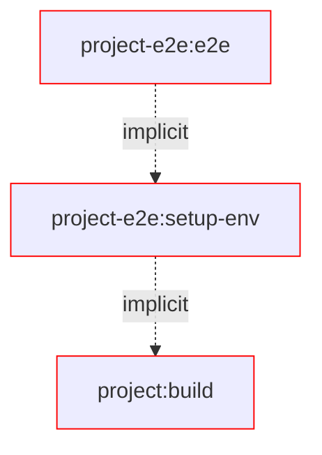
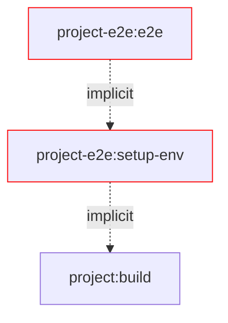
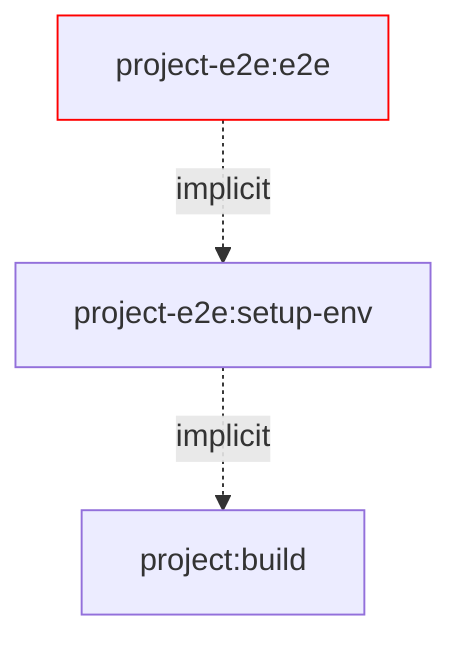

# Nx Verdaccio Environment Plugin

This plugin provides a zeros configuration setup to run e2e tests in a package manager environment.

## Getting started

1. Register and configure the plugins in `nx.json`:

```jsonc
{
  "plugins": [
    {
      "plugin": "@org/build-env",
      "options": {
        "environmentsDir": "tmp/environments" // Optional
      }
    }
  ]
}
```

Now you can configure the project you want to e2e test as published package.

2. Add a `publishable` tag to the package under test to tell the plugin which projects it should consider as publishable 

```jsonc
// projects/my-lib/project.json
{
  "name": "my-lib",
  "targets": ["publish", "nx-release-publish"]
  "tags": ["publishable"] // Optionally filter projects by tags for a more finegrained control
  // ...
}
```

Next you need to configure the e2e project that uses the package under test.

3. Add the package under test as `implicitDependency` to your e2e project. The plugin will detect implicit dependencies and use them for the environment setup. 

```jsonc
// projects/my-lib-e2e/project.json
{
  "name": "my-lib-e2e",
  "implicitDependency": ["my-lib"]
}
```

4. Configure the `setup-env` target as dependent target in your e2e test project by using `dependsOn`

```jsonc
{
  "name": "my-lib-e2e",
  "targets": {
    "e2e": {
      "dependsOn": [
        {
          "projects": "self",
          "target": "setup-env",
          "params": "forward"
        }
      ]
      // ...
    }
  }
  // ...
}
```

Now you are ready to go.

5. Run your e2e test with `nx run my-lib-e2e:e2e`

Tadaaaa! 🎉

**Example usage:**
- `nx run cli-e2e:e2e` - setup environment and then run E2E tests for `cli-e2e`
- `nx run cli-static-e2e:e2e --environmentRoot static-environments/user-lists` - setup NPM in existing environment and then run E2E tests for `cli-static-e2e`


## DX while debugging e2e tests

Debug full environment in 1 setup:

- `nx run cli-e2e:setup-env` - setup environment for `cli-e2e`
  - `nx run cli-e2e:setup-env --keepServerRunning` - keeps Verdaccio running after setup
- `nx run cli-e2e:stop-verdaccio` - stops the Verdaccio server for `cli-e2e`

Debug full environment in 2 steps:

- `nx run cli-e2e:bootstrap-env` - setup folders and starts Verdaccio for `cli-e2e`
- `nx run cli-e2e:install-env` - bootstraps and installs all dependencies for `cli-e2e`
- `nx run cli-e2e:stop-verdaccio` - stops the Verdaccio server for `cli-e2e`

Debug packages:

- `nx run cli-e2e:bootstrap-env` - setup folders and starts Verdaccio for `cli-e2e`
- `nx run utils:npm-publish --environmentProject cli-e2e` - publishes `utils` and `models` to the Verdaccio registry configured for `cli-e2e`
- `nx run utils:npm-install --environmentProject cli-e2e` - installs `utils` and `models` from the Verdaccio registry configured for `cli-e2e`
- `nx run cli-e2e:stop-verdaccio` - stops the Verdaccio server for `cli-e2e`

## Benefits in depth

In the below we point out a **scalable** and **maintainable** setup for Verdaccio environments.

### 🛡️ Isolation of Files During E2E Tests

All files that change during testing are contained within an isolated folder, ensuring they don't interfere with your local setup or other tests.

By isolating the environment for each E2E project, you avoid conflicts with the local file system and package manager configurations, enabling parallel test execution without issues like publish, install or file conflicts.

```sh
Root/
├── dist/
│   └── packages/
│       └── <project-name>/...
├── tmp/
│    └── e2e/
│        └── <project-name>/
│            ├── storage/... # npm publish/unpublish
│            │   └── @my-org
│            │       └── my-lib/...
│            ├── node_modules/
│            │   └── <org>
│            │        └── <package-name>/... # npm install/uninstall 
│            ├── __test__/...
│            │   └── <test-file-name>/... 
│            │        └── <it-block-setup>/...
│            │             └── test.file.ts
│            ├── .npmrc # local npm config configured for project specific Verdaccio registry
│            ├── package-lock.json # skipped creation by default
│            └── package.json # npm install/uninstall
└── packages/
    └── <project-name>/...
```

### 🚀 Scalability - A Parallel-Friendly Setup

This solution allows for **parallel execution** of tests, which was not possible before due to conflicts with file systems and package managers.

- ⏱️No more waiting for tests to run sequentially. With isolated environments, each E2E test can run independently without interfering with others.
- ⏱️Environment setup and test setup are separated, which means **significantly faster execution** of the tests and less overhead in CPU and general runtime. 

### ⚡ Task Performance - Optimized Execution

To further improve task performance, we can now treat the E2E environment as **build output**. 
No need for a running server anymore.

This allows us to **cache** the environment and **reuse** it across tests, leading to faster performance:

- 🔥 As it is decoupled from the running server we can now save cache the target
- 🔥 No need to stop and restart the server between tests, saving CPU and memory
- 🔥 No need to uninstall packages or delete storage folders manually. We can simply delete the isolated folder when needed.
- 🔥 The system only installs the necessary packages, further reducing time and resource usage.


#### Changes in source



#### Changes in the test environments



#### Changes in tests



### ✨ DX - Developer Experience Simplified

The **NX task graph** makes it easier to discover and understand the setup. Instead of relying on complex global setup scripts:

- 🤌 No need for global setup files teardown or setup at all. The only connection to the tests files is just another target that runs before the E2E tests.
- 🤌 The process is faster because the test environment doesn’t require ongoing CPU or memory once set up.
- 🤌 Errors are easier to debug. Every step is on its own debugable.

### 🔧 Maintainability - Easy to Update and Manage

This approach makes the E2E setup more **maintainable** and easier to serve edge cases:

- A fine-grained task graph makes it easy to understand the project
- Since the environment doesn’t require a constantly running server, maintaining the setup becomes much simpler. The environment can be cached as a build output, reducing complexity.
- as the cleanup logic of a test is just deleting the files this debug effort is gone completely 
- The NX task graph provides a clear visual overview of the process, making it easy to see what runs when and how the environment is set up.
- Configuring a test setup is in a single place and provides fine-grained configuration


In summary, this new setup offers a more scalable, maintainable, and performant way to handle E2E testing. 
By isolating environments and using NX’s powerful tools, it becomes easier to run, manage, and debug E2E tests across projects.

- make verdaccio-registry.json a constant!

- in `npm-install` executor:

  - make buildTarget configurable in the executor options, default to 'build'
  - use getPackageManagerCommand().install instead to be able to support yarn installation as well
  - use detectPackageManager() and getPackageManagerVersion() to deduce the userconfig path (e.g. .yarnrc, .npmrc, etc.)

- use [createNodesV2](https://nx.dev/nx-api/devkit/documents/CreateNodesV2) instead of [createNodes](https://nx.dev/nx-api/devkit/documents/CreateNodes) in `tooling/build-env/src/plugin/verdaccio-env.plugin.ts`

- in the plugin code, (maybe I got it wrong) it looks like some targets should only be added to the e2e project, but they are added to all projects.

```ts
export const createNodes: CreateNodes = [
  '**/project.json',
  (projectConfigurationFile) => {
    const projectConfiguration: ProjectConfiguration = readJsonFile(join(process.cwd(), projectConfigurationFile));
    const projectName = projectConfiguration.name;
    const graph = readCachedProjectGraph();
    const projectNode = graph.nodes[projectConfiguration.name];
    if (projectNode.type !== 'e2e') {
      return {
        // npmTargets
      };
    }
    return {
      // verdaccioTargets, envTargets
    };
  },
];
```

## Connect with us!

- [Check out our services](https://push-based.io)
- [Follow us on Twitter](https://twitter.com/pushbased)
