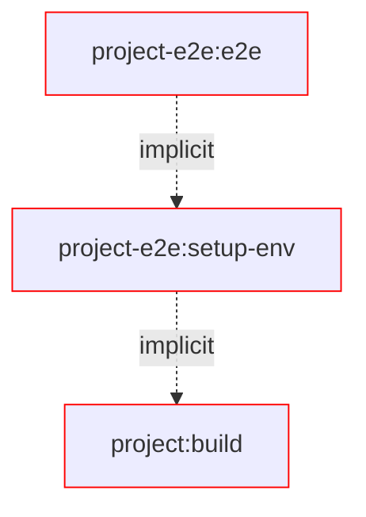
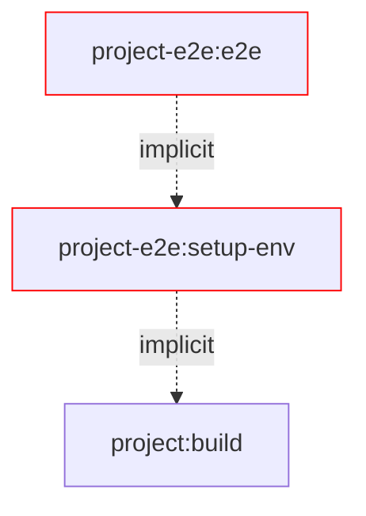
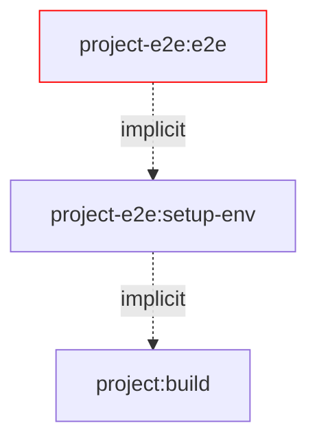

# Buildable Test Environment Plugin

This plugin provides a zeros configuration setup to run e2e tests in a package manager environment.

## Getting started

1. Register and configure the plugins in `nx.json`:

```jsonc
{
  "plugins": [
    {
      "plugin": "@org/build-env",
      "options": {
        "environmentsDir": "tmp/environments" // Optional
      }
    }
  ]
}
```

Now you can configure the project you want to e2e test as published package.

2. Add a `publishable` tag to the package under test to tell the plugin which projects it should consider as publishable 

```jsonc
// projects/my-lib/project.json
{
  "name": "my-lib",
  "targets": ["publish", "nx-release-publish"]
  "tags": ["publishable"] // Optionally filter projects by tags for a more finegrained control
  // ...
}
```

Next you need to configure the e2e project that uses the package under test.

3. Add the package under test as `implicitDependency` to your e2e project. The plugin will detect implicit dependencies and use them for the environment setup. 

```jsonc
// projects/my-lib-e2e/project.json
{
  "name": "my-lib-e2e",
  "implicitDependency": ["my-lib"]
}
```

4. Configure the `setup-env` target as dependent target in your e2e test project by using `dependsOn`

```jsonc
{
  "name": "my-lib-e2e",
  "targets": {
    "e2e": {
      "dependsOn": [
        {
          "projects": "self",
          "target": "setup-env",
          "params": "forward"
        }
      ]
      // ...
    }
  }
  // ...
}
```

Now you are ready to go.

5. Run your e2e test with `nx run my-lib-e2e:e2e`

Tadaaaa! 🎉

## DX while debugging e2e tests

### Production usage:

- `nx run cli-e2e:e2e` - setup environment and then run E2E tests for `cli-e2e`
  @TODO figure out why we can't set the environmentRoot in the target options in `project.json`
- `nx run cli-static-e2e:e2e --environmentRoot static-environments/user-lists` - setup NPM stuff in existing environment and then run E2E tests for `cli-static-e2e`

Debug full environment in 1 setup:

- `nx run cli-e2e:setup-env` - setup environment for `cli-e2e`
  - `nx run cli-e2e:setup-env --keepServerRunning` - keeps verdaccio running after setup
- `nx run cli-e2e:stop-verdaccio` - stops the verdaccio server for `cli-e2e`

Debug full environment in 2 steps:

- `nx run cli-e2e:bootstrap-env` - setup folders and starts verdaccio for `cli-e2e`
- `nx run cli-e2e:install-env` - bootstraps and installs all dependencies for `cli-e2e`
- `nx run cli-e2e:stop-verdaccio` - stops the verdaccio server for `cli-e2e`

Debug packages:

- `nx run cli-e2e:bootstrap-env` - setup folders and starts verdaccio for `cli-e2e`
- `nx run utils:npm-publish --environmentProject cli-e2e` - publishes `utils` and `models` to the verdaccio registry configured for `cli-e2e`
- `nx run utils:npm-install --environmentProject cli-e2e` - installs `utils` and `models` from the verdaccio registry configured for `cli-e2e`
- `nx run cli-e2e:stop-verdaccio` - stops the verdaccio server for `cli-e2e`


## Solution

This workspace provides a scalable and maintainable E2E setup for Vite tests and Verdaccio.
It isolates all involved files into an isolated environment for each e2e project.

### Changes files during e2e

The changed files during testing, are all in one isolated folder and don't interfere with your local setup.

```sh
Root/ # 👈 this is your CWD
├── dist/
│   └── packages/
│       └── <project-name>/...
└── tmp/
    └── e2e/
        └── <project-name>/ # e2e setup
            ├── storage/... # npm publish/unpublish
            ├── node_modules/
            │   └── <org>
            │       └── <package-name>/... # npm install/uninstall
            ├── __test__/...
            │   └── <file-name>/... # e2e beforeEach
            │        └── <it-block-setup>/...
            ├── .npmrc # local npm config configured for project specific verdaccio registry
            ├── package-lock.json # npm install/uninstall
            └── package.json # npm install/uninstall
```

### Task Performance

To elaborate on the performance improvements, we show the different cases while writing tests.

#### Changes in source



#### Changes in the test environments



#### Changes in tests



## Connect with us!

- [Check out our services](https://push-based.io)
- [Follow us on Twitter](https://twitter.com/pushbased)
