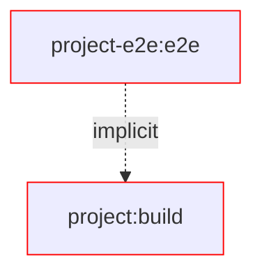
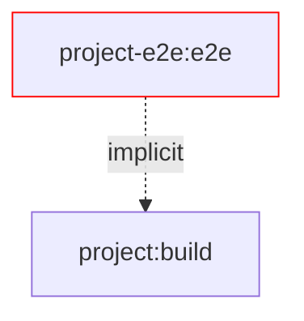
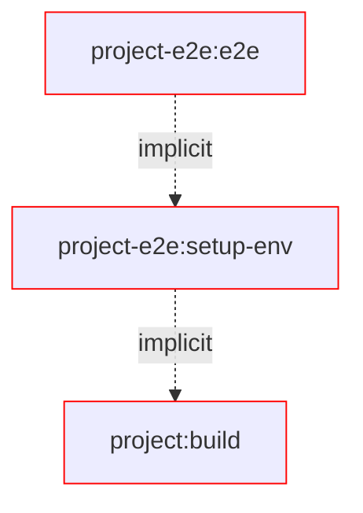
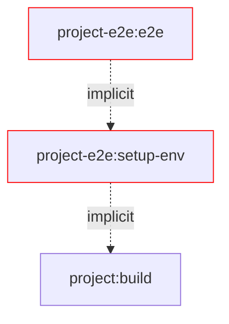
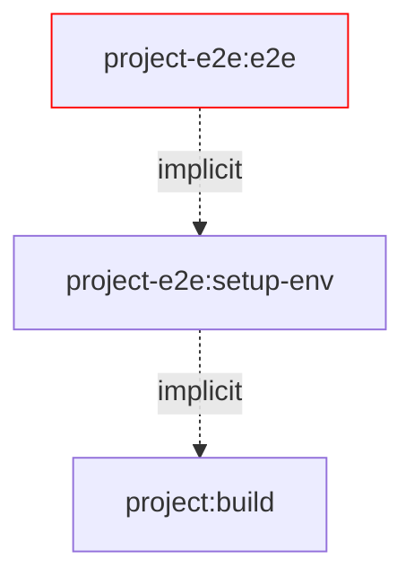

# Motivation

The following document explains the motivation behind this library and the problems it solves.
We will discuss common e2e setups in the wild, what problems they have and why they are pretty limited in their scalability and performance.

What is not covered in this document is basic knowledge about Verdaccio as wel as Nx.

Let's start of by explaining the common e2e setups.

## Common e2e setup for publishable packages

To get e2e tests setup with Verdaccio we typically need the following building blocks:

- A package we want to test
- A global setup script used by your testing lib to sets up the environment before running all tests
- A test executing the package

The interesting part here is the global setup script. So let's take a closer look at it this first.

The following is a simplified version of a global setup script used by your testing lib.

```ts
// global-setup.ts
import { rm } from 'node:fs/promises';
import { executeProcess, objectToCliArgs } from '@org/test-utils';
import { configureRegistry, RegistryResult, startVerdaccioServer, unconfigureRegistry } from '@org/tools-utils';

export async function setup() {
  const { verdaccioPort } = await startVerdaccioServer({
    storage: 'local-registry/storage',
  });

  // Configure npm with form the created Verdaccio registry
  // `npm config set registry http://localhost:${verdaccioPort}`
  // `npm config set //localhost:${verdaccioPort}:_authToken "my-auth-token"`
  configureRegistry(verdaccioPort);

  // Publish the package to test to the Verdacio storage (local-registry/storage)
  // `npm publish @my-org/my-lib@0.0.1 --registry=http://localhost:${verdaccioPort}`
  await publishProject('my-lib');

  // Install the package locally
  // `npm install my-lib --registry=http://localhost:${verdaccioPort}`
  await installProject('my-lib');
}

export async function teardown() {
  // Uninstall the package from the Verdacio storage (local-registry/storage)
  // `npm uninstall my-lib`
  await uninstallProject('my-lib');

  // Revert configure npm with form the created Verdaccio registry
  // `npm config delete registry`
  // `npm config delete //localhost:${verdaccioPort}:_authToken`
  unconfigureRegistry(registry, isVerbose);

  stopVerdaccioServer();

  // Delete the Verdaccio storage
  await rm('local-registry/storage', { recursive: true, force: true });
}
```

Now you could run `nx run my-lib-e2e:e2e` which would start the server publish and install, executes the tests and runs the cleanup logic.
Viola, you have a working e2e setup for your package. 🎉

But wait! There is are MANY caveats with this setup. Let's discuss them one by one.

## File system changes while running the e2e test

The following file tree is a result of running our e2e setup.
It is particular bad as it interfere with your local package manager configuration.

```sh
User/
 └── <user-name>/
     ├── .npmrc # 🔓 added registry and auth token entry to OS user specific npm config
     └──Root/ # 👈 this is your CWD
        ├── node_modules/
        │   └── @my-org
        │       └── my-lib/... # 🔓 npm install installs into repository folder
        ├── dist/
        │   └── packages/
        │       └── my-lib/...
        ├── e2e/
        │   └── my-lib-e2e/
        │       └── some.test.ts
        ├── tmp/
        │   └── local-registry/
        │       └── storage/
        │           └── @my-org
        │               └── my-lib/... # npm publish saves the package's tarball here
        ├── package-lock.json # 🔓 npm install/uninstall installs into workspace root
        └── package.json # 🔓 npm install/uninstall installs into workspace root
```

### Task Performance

To elaborate on the performance issues, we show the different cases while writing tests.

#### Changes in source



#### Changes in the test environments


#### Changes in tests



## Solution

This workspace provides a scalable and maintainable E2E setup for Vite tests and Verdaccio.
It isolates all involved files into an isolated environment for each e2e project.

### Changes files during e2e

The changed files during testing, are all in one isolated folder and don't interfere with your local setup.

```sh
Root/ # 👈 this is your CWD
├── dist/
│   └── packages/
│       └── <project-name>/...
└── tmp/
    └── e2e/
        └── <project-name>/ # e2e setup
            ├── storage/... # npm publish/unpublish
            ├── node_modules/
            │   └── <org>
            │       └── <package-name>/... # npm install/uninstall
            ├── __test__/...
            │   └── <file-name>/... # e2e beforeEach
            │        └── <it-block-setup>/...
            ├── .npmrc # local npm config configured for project specific verdaccio registry
            ├── package-lock.json # npm install/uninstall
            └── package.json # npm install/uninstall
```

### Task Performance

To elaborate on the performance improvements, we show the different cases while writing tests.

#### Changes in source



#### Changes in the test environments



#### Changes in tests


