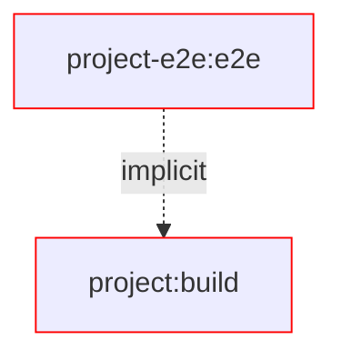
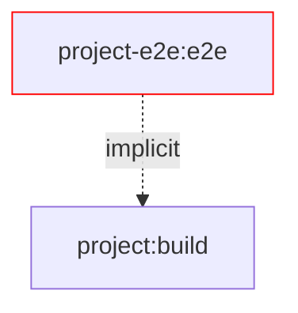
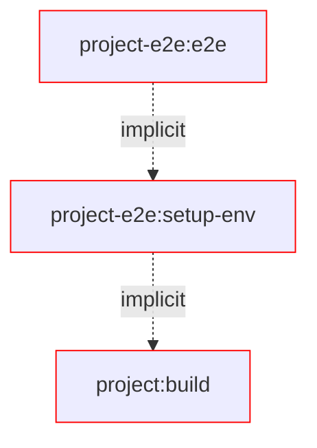
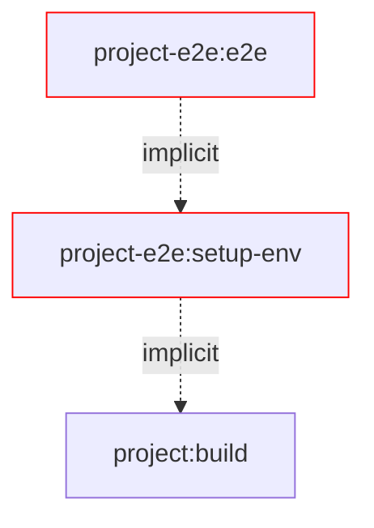
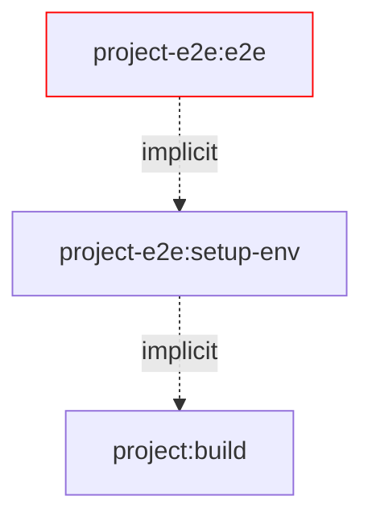

# Motivation

The following document explains the motivation behind this library and the problem it solves.
We will discuss [common E2e setup for publishable packages](#Common-E2E-setup-for-publishable-packages) in the wild, what problems they have and why they are pretty limited in their scalability and performance.

> [!NOTE]
> What is not covered in this document is basic knowledge about Verdaccio as well as Nx.

Before we go into more detail let's quickly list the problems here to later on dive into each of them individually:

**The problems:**

- 🚪 **Isolation** - Conflicts the file system as well as changes in the local configuration of the developer machine.
- 📉 **Scalability** - The setup can only run in sequence and after every test we have to run a lot of cleanup scripts. In case of an error the whole chain has to rerun.
- 🐢 **Task Performance** - The test environment setup in not cacheable and as the server has to run while the tests execute, it slows done the whole task.
- 🔫 **DX** - In case of an error there is no easy way to debug the test setup independent of the test.
- 🧟‍ **Maintainability** - It is very hard to maintain the test setup as it is very complex and has a lot of moving partsnthat are hard to understand and debug.

Let's start off by explaining the common e2e setups.

## Common E2E setup for publishable packages

To get e2e tests setup with Verdaccio we typically need the following building blocks:

- A package we want to test
- A global setup script used by your testing lib to sets up the environment before running all tests
- A test executing the package

The interesting part here is the global setup script. So let's take a closer look at it this first.

The following is a simplified version of a global setup script used by your testing lib.

```ts
// global-setup.ts
import { rm } from 'node:fs/promises';
import { executeProcess, objectToCliArgs } from '@org/test-utils';
import { configureRegistry, RegistryResult, startVerdaccioServer, unconfigureRegistry } from '@org/tools-utils';

export async function setup() {
  const { verdaccioPort } = await startVerdaccioServer({
    storage: 'local-registry/storage',
  });

  // Configure npm with form the created Verdaccio registry
  // `npm config set registry http://localhost:${verdaccioPort}`
  // `npm config set //localhost:${verdaccioPort}:_authToken "my-auth-token"`
  configureRegistry(verdaccioPort);

  // Publish the package to test to the Verdacio storage (local-registry/storage)
  // `npm publish @my-org/my-lib@0.0.1 --registry=http://localhost:${verdaccioPort}`
  await publishProject('my-lib');

  // Install the package locally
  // `npm install my-lib --registry=http://localhost:${verdaccioPort}`
  await installProject('my-lib');
}

export async function teardown() {
  // Uninstall the package from the Verdacio storage (local-registry/storage)
  // `npm uninstall my-lib`
  await uninstallProject('my-lib');

  // Revert configure npm with form the created Verdaccio registry
  // `npm config delete registry`
  // `npm config delete //localhost:${verdaccioPort}:_authToken`
  unconfigureRegistry(registry, isVerbose);

  stopVerdaccioServer();

  // Delete the Verdaccio storage
  await rm('local-registry/storage', { recursive: true, force: true });
}
```

Now you could run `nx run my-lib-e2e:e2e` which would start the server publish and install, executes the tests and runs the cleanup logic.
Viola, you have a working e2e setup for your package. 🎉

But wait! There are MANY caveats with this setup. We mentioned them already in the beginning, now let's discuss them one by one.

## Problems

### 🚪 Isolation of the E2E tests

The following file tree is a result of running our e2e setup.
It is particular bad as it interfere with your local package manager configuration as well as conflicts with other tests if not run in sequence.

```sh
User/
 └── <user-name>/
     ├── .npmrc # 🔓 added registry and auth token entry to OS user specific npm config
     └──Root/ # 👈 this is your CWD
        ├── node_modules/
        │   └── @my-org
        │       └── my-lib/... # 🔓 npm install installs into repository folder
        ├── dist/
        │   └── packages/
        │       └── my-lib/...
        ├── e2e/
        │   └── my-lib-e2e/
        │       └── some.test.ts
        ├── tmp/
        │   └── local-registry/
        │       └── storage/
        │           └── @my-org
        │               └── my-lib/... # npm publish saves the package's tarball here
        ├── package-lock.json # 🔓 npm install/uninstall installs into workspace root
        └── package.json # 🔓 npm install/uninstall installs into workspace root
```

As the tests change the local configuration of the package manager, it is not possible to run multiple tests in parallel.
Installing/uninstalling or publishing a package will end up in conflicts with other tests.
You are forced to run the tests in sequence.

**Publish conflict:**

1. Test A: `npm publish @org/pkg@0.0.1 --registry=http://localhost:4873` # ✅
2. Test B: `npm publish @org/pkg@0.0.1 --registry=http://localhost:4873` # ❌ package already exists in registry

**Install/uninstall conflict:**

1. Test A: `npm install @org/pkg@0.0.1 --registry=http://localhost:4873` # ✅
2. Test B: `npm install @org/pkg@0.0.1 --registry=http://localhost:4873` # ✅
3. Test B: `nx e2e pkg` # ✅
4. Test B: `npm uninstall @org/pkg@0.0.1 --registry=http://localhost:4873` # ✅
5. Test A: `nx e2e pkg` # ❌ package not installed

### 📉 Scalability

As mentioned the tests don't scale, which is mostly related to the first problem.

To run 1 E2E test the following chain has to happen:

- Start Verdaccio server - to be able to publish packages to and install from
- NPM publish the package to the Verdaccio server
- NPM install the package to the Start Verdaccio server
- Execute the actual e2e tests over playwrite, vitest, jest or other test runner
- NPM uninstall the package from the local setup
- Stop the Verdaccio server
- Delete the storage folder

As you can see, the majority of the tasks are just here as we can't parallelize. :(

### 🐢 Task Performance

We already scratched that topic a bit, but in this chapter we can go in full detail.
Let's start with looking at the steps from above.

If we could run them in parallel the following steps would not need to happen:

- 🐢 NPM uninstall the package from the local setup
- 🐢 Delete the storage folder

If we would not have to keep the server running for the whole test we can also:

- 🐢 Stop wasting CPU power and memory that is consumed by the server
- 🐢 Think about options to cache parts of the steps

Especially the caching is interesting to dive deeper in.
Let's look at different scenarios and what they miss.

#### Changes in source



#### Changes in the test environments


#### Changes in tests



### 🔫 DX

TBD

### 🧟‍ Maintainability

TBD

## Solution

This workspace provides a scalable and maintainable E2E setup for Vite tests and Verdaccio.
It isolates all involved files into an isolated environment for each e2e project.

### Changes files during e2e

The changed files during testing, are all in one isolated folder and don't interfere with your local setup.

```sh
Root/ # 👈 this is your CWD
├── dist/
│   └── packages/
│       └── <project-name>/...
└── tmp/
    └── e2e/
        └── <project-name>/ # e2e setup
            ├── storage/... # npm publish/unpublish
            ├── node_modules/
            │   └── <org>
            │       └── <package-name>/... # npm install/uninstall
            ├── __test__/...
            │   └── <file-name>/... # e2e beforeEach
            │        └── <it-block-setup>/...
            ├── .npmrc # local npm config configured for project specific verdaccio registry
            ├── package-lock.json # npm install/uninstall
            └── package.json # npm install/uninstall
```

### Task Performance

To elaborate on the performance improvements, we show the different cases while writing tests.

#### Changes in source



#### Changes in the test environments



#### Changes in tests


