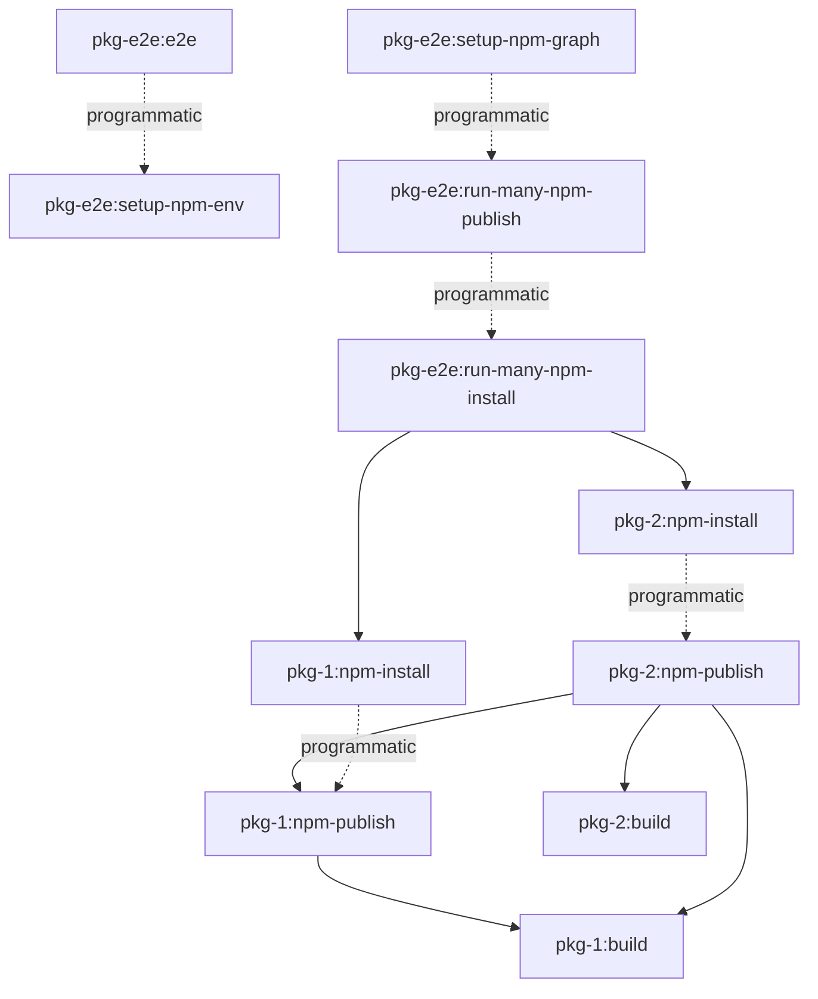

# cli-e2e

End-to-end tests for the `cli-e2e` library.

## Running the tests

- 🧰 `nx setup-env cli-e2e`
  - 💾 _outputs:_ [`tmp/e2e/cli-e2e`]
  - 🌐 `nx setup-npm-env cli-e2e`
    - ▶️ start Verdaccio server
    - 📑 init workspace folder
  - 📦 `nx install-deps cli-e2e`
  - 🧼 `nx teardown-npm-env cli-e2e`
    - 🛑 stop Verdaccio server
    - 🗑 delete storage folder
- 🔬 `nx run cli-e2e:e2e` - **👈 your entered command**

  - _dependsOn:_ [`setup-env:cli-e2e`]
  - 🧪run tests

- 🧰 `nx setup-env cli-e2e`
  - _outputs:_ [`tmp/e2e/cli-e2e`] 💾
  - 🌐 `nx setup-npm-env cli-e2e`
    - start Verdaccio server
    - init workspace folder
  - 📦 `nx install-deps cli-e2e`
  - 🧼 `nx teardown-npm-env cli-e2e`
    - stop Verdaccio server
    - delete storage folder
- 🔬 `nx run cli-e2e:e2e` - **👈 your entered command**
  - _dependsOn:_ [`setup-env:cli-e2e`]
  - run tests



### Changed or generated files during e2e

```sh
Root/ # 👈 this is your CWD
├── dist/
│   └── packages/
│       └── <project-name>/...
└── tmp/
    └── e2e/
        └── <project-name>/ # e2e setup
            ├── storage/... # npm publish/unpublish
            ├── node_modules/
            │   └── <org>
            │       └── <package-name>/... # npm install/uninstall
            ├── __test__/...
            │   └── <file-name>/... # e2e beforeEach
            │        └── <it-block-setup>/...
            ├── .npmrc # local npm config configured for project specific verdaccio registry
            ├── package-lock.json # npm install/uninstall
            └── package.json # npm install/uninstall
```

### Troubleshooting

- `nx start-server`
- `nx start-server <project-name>`
- `nx start-server <project-name> --storage tmp/e2e/<project-name>/storage`
- `nx start-env`
- `nx start-env <project-name> --workspaceRoot tmp/e2e/<project-name>`
- `nx npm-publish <project-name> --envProject=<graph-project-name>`
- `nx run-many -t npm-publish --envProjectName=cli-e2e`
- `nx npm-install <project-name> --envProject=<graph-project-name>`
- `nx run-many -t npm-install --envProjectName=cli-e2e`
