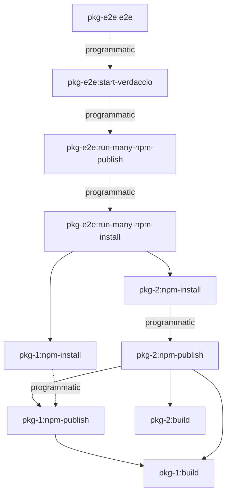

# cli-e2e-original

End-to-end tests for the `cli` library.

## Included plugins

- `tools/plugins/original.plugin.ts`

### Dynamic targets generated by the plugin

- `workspace-source`
  - targets
    - `local-registry`
- `cli-e2e-original`
  - targets
    - `e2e`
- `models`,`utils`,`core`,`cli`
  - tags
    - `publishable`
  - targets
    - `original-npm-publish`
    - `original-npm-install`
    - `original-npm-uninstall`

## Running the tests

- `nx e2e cli-e2e-original` - run E2E tests for the `cli-e2e-original` library.
  - run vitest setup - `e2e/cli-e2e-original/setup/global-setup.ts#setup`
    - `nx local-registry --storage`
    - `nx run-many --targets=original-npm-publish`
    - `nx run-many --targets=original-npm-install`
  - run tests
  - run vitest teardown - `e2e/cli-e2e-original/setup/global-setup.ts#teardown`
    - stop server
    - delete folder



### Changed or generated files during e2e

```sh
User/
 └── <user-name>/
     ├── .npmrc # 🔓 added registry and token entry to OS user specific npm config
     └──Root/ # 👈 this is your CWD
        ├── node_modules/
        │   └── <org>
        │       └── <package-name>/... # 🔓 npm install installs into repository folder
        ├── dist/
        │   └── packages/
        │       └── <project-name>/...
        ├── tmp/
        │   └── local-registry/ # 😓 hard to debug a dynamic port
        │       ├── storage/...
        │       │   └── <org>
        │       │       └── <package-name>/... # nx nx-release-publish saves the package's tarball here
        │       └── <test-name>/...
        │                └── <test-case>/...
        ├── package-lock.json # 🔓 npm install/uninstall installs into workspace root
        └── package.json # 🔓 npm install/uninstall installs into workspace root
```

## Troubleshooting

### Is my environment free up from any artefacts from previous runs?

1. Check if any package is installed from previouse runs
   - run `npm ls <package-name>` to see if the package is installed in your workspace
     Example output:

```sh
@org/source@0.0.0 /Users/<user-name>/<workspace-root>
└── <org>/<project-name>@0.0.1 # 👈 this is a potential left over package from your e2e test
```

1. 1. Remove the package from your workspace
   - run `nx run-many -t original-npm-uninstall` to remove the package from your workspace
     Example output of clean `npm ls <package-name>` run:

```sh
@org/source@0.0.0 /Users/<user-name>/<workspace-root>
└── (empty)
```

### Is my environment free up from any configuration from previous runs?

1. Check if your environment is clean
   - run `npm config list -ls` to see if there are any unexpected registries or tokens in any of your config files
     Example Output:

```sh
; "default" config from default values
# ...
metrics-registry = "http://localhost:4873/"
prefix = "/usr/local"
# ...
; registry = "https://registry.npmjs.org/" ; overridden by user
# ...
userconfig = "/Users/michael_hladky/.npmrc"
# ...
; "user" config from /Users/michael_hladky/.npmrc

registry = "http://localhost:4873/" # 👈 this is a potential left over configuration form your e2e test

; "cli" config from command line options

# ...
```

- Clean potential entries from your OS user specific npm config
  - `npm config delete registry`
  - `npm config delete <registry-name>:_authToken`

Example output after cleanup:

```sh
; "default" config from default values

# ...
metrics-registry = "https://registry.npmjs.org/"
prefix = "/usr/local"
registry = "https://registry.npmjs.org/"
# ...
userconfig = "/Users/michael_hladky/.npmrc"
# ...
; "cli" config from command line options

# ...
```

### Is Verdaccio server running correctly?

While the tests are running you can open your browser and visit http://localhost:<port>/ to see the Verdaccio web interface.

To start it manually do the following steps:

1. Start local registry manually with `nx local-registry --verbose` - logs port
2. 1. Run `npm config list -ls` to see if the registry and auth token are configured correctly
      Example output with correct configuration:

```sh
; "default" config from default values
# ...
metrics-registry = "http://localhost:4873/"
prefix = "/usr/local"
# ...
; registry = "https://registry.npmjs.org/" ; overridden by user
# ...
userconfig = "/Users/michael_hladky/.npmrc"
# ...
; "user" config from /Users/michael_hladky/.npmrc

//localhost:4874/:_authToken = (protected) # 👈 this is the auth token for your Verdaccio registry
registry = "http://localhost:4873/" # 👈 this the default registry

; "cli" config from command line options

# ...
```

2. 2. Check if a package is published with `nx npm-check <project-name> --registry=http://localhost:4873`
      Example of an empty web interface:

### Is my e2e script publishing to the right registry?
