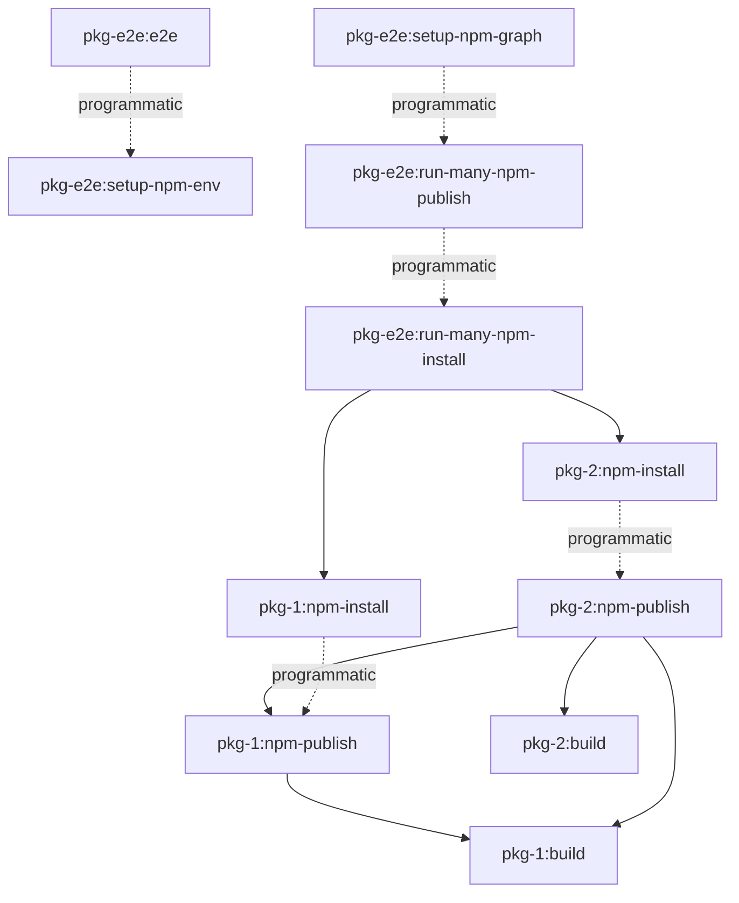

# core-e2e

End-to-end tests for the `core-e2e` library.

## Included plugins

- `tools/plugins/env.plugin.ts`

### Dynamic targets generated by the plugin

- `workspace-source`
  - targets
    - `graph-start-verdaccio`
    - `graph-setup-npm-env`
- `core-e2e`
  - targets
    - `e2e`
- `models`,`utils`,`core`,`cli`
  - tags
    - `publishable`
  - targets
    - `graph-npm-publish`
    - `graph-npm-install`
    - `graph-npm-uninstall`

## Running the tests

- `nx e2e core-e2e` - run E2E tests for the `core-e2e` library.
  - run vitest setup - `e2e/core-e2e/setup/global-setup.ts#setup`
    - `nx graph-setup-npm-env core-e2e`
    - `nx run-many --targets=graph-npm-publish`
    - `nx run-many --targets=graph-npm-install`
  - run tests
  - run vitest teardown - `e2e/core-e2e/setup/global-setup.ts#teardown`
    - stop server
    - delete folder



### Changed or generated files during e2e

```sh
Root/ # 👈 this is your CWD
├── dist/
│   └── packages/
│       └── <project-name>/...
└── tmp/
    └── e2e/
        └── <project-name>/ # e2e setup
            ├── storage/... # npm publish/unpublish
            ├── node_modules/
            │   └── <org>
            │       └── <package-name>/... # npm install/uninstall
            ├── __test__/...
            │   └── <file-name>/... # e2e beforeEach
            │        └── <it-block-setup>/...
            ├── .npmrc # local npm config configured for project specific verdaccio registry
            ├── package-lock.json # npm install/uninstall
            └── package.json # npm install/uninstall
```

### Troubleshooting

- `nx start-server`
- `nx start-server <project-name>`
- `nx start-server <project-name> --storage tmp/e2e/<project-name>/storage`
- `nx start-env`
- `nx start-env <project-name> --workspaceRoot tmp/e2e/<project-name>`
- `nx npm-publish <project-name> --envProject=<graph-project-name>`
- `nx run-many -t npm-publish --envProjectName=core-e2e`
- `nx npm-install <project-name> --envProject=<graph-project-name>`
- `nx run-many -t npm-install --envProjectName=core-e2e`
